# TuneLM implementation

## Scope

This repository implements the first research-system milestone described in
`design_docs/plan.md`: common task contracts, an executable Strudel verifier,
provider-independent SFT data creation, procedural RL tasks, SFT/GRPO training
entry points, modular rewards, evaluation, and inference.

Audio rendering and subjective music-quality rewards are deliberately deferred.
They are expensive, hard to verify, and should only be introduced after the
execution and constraint baselines are measured.

## Architecture

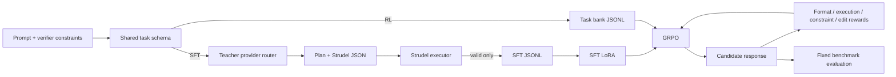

The boundaries are intentional. Teacher solutions are never stored in RL task
files, reward functions do not depend on trainer internals, and model selection
lives in YAML.

## Output contract

Every model completion must be one JSON object:

```json
{
  "plan": {
    "tempo": 120,
    "instruments": ["bd", "sd", "bass"],
    "structure": "intro, build, ending",
    "musical_intent": "driving electronic groove"
  },
  "controls": {
    "bpm": 120,
    "key": "C:minor",
    "mood": ["driving"],
    "layers": [
      {"id": "drums", "role": "rhythm", "sounds": ["bd", "sd"]},
      {"id": "bass", "role": "bass", "sounds": ["bass"]}
    ]
  },
  "strudel_code": "setcpm(120/4)\nstack(s(\"bd sd\"), note(\"c2 g2\").s(\"gm_electric_bass_finger\"))"
}
```

`src/tunelm/schemas.py` is the canonical contract. Pydantic rejects missing and
unknown fields so format reward cannot silently accept a drifted representation.
The response parser accepts plain JSON and a fenced JSON object for robustness,
although the system prompt asks models to emit plain JSON.

## System prompts

Every LLM call in data generation, training formatting, and inference uses an
explicit system prompt. Procedural-only paths (RL `mode: procedural` without
`prompt_author`) fill prompts from vocab templates and never call a provider.

| Workflow | Stage | System prompt | Location |
|---|---|---|---|
| SFT compose prompt | `prompts`, `full` | `LEVEL_SYSTEM_PROMPTS` (levels 1–4) | `src/tunelm/sft_data/prompt_author.py` |
| SFT edit/repair prompt | `prompts`, `full` | `STYLE_SYSTEM_PROMPTS` (imperative, conversational, direct, …) | `src/tunelm/rl_data/prompt_author.py` |
| SFT teacher response | `responses`, `full` | `SYSTEM_PROMPT` (plan + Strudel JSON contract) | `src/tunelm/models/templates.py` |
| RL task prompt rewrite | `prompts`, `tasks`, `full` when `prompt_author` set | `STYLE_SYSTEM_PROMPTS` per task type | `src/tunelm/rl_data/prompt_author.py` |
| RL hybrid task synthesis | `mode: hybrid` LLM slice only | `RL_LLM_TASK_SYSTEM_PROMPT` | `src/tunelm/rl_data/llm_generator.py` |
| Inference / eval | runtime | `SYSTEM_PROMPT` (same as teacher) | `src/tunelm/models/templates.py` |

SFT compose uses complexity levels; SFT edit/repair and RL prompt authoring use
style personas (`compose_styles`, `edit_styles`, `repair_styles` in YAML, with
built-in defaults in code). Teacher and inference share one response contract so
SFT labels match what the model sees at deploy time.

### Response system prompt (`SYSTEM_PROMPT`)

SFT teacher generation, GRPO rollouts, and inference all use the same
`SYSTEM_PROMPT` in `src/tunelm/models/templates.py`. It defines:

- the `plan` + `controls` + `strudel_code` JSON contract (validated by `ModelResponse`)
- a link to the [Strudel getting-started workshop](https://strudel.cc/workshop/getting-started/)
- Strudel coding conventions the verifier expects (`setcpm`, `s`, `note`, `stack`,
  mini-notation, sound identifiers from the user message)
- per-task behavior for compose, edit, and repair
- constraint satisfaction and sandbox rules (no `samples()`, network, or side effects)

The user message from `task_user_prompt()` carries only what a real user would
see: the natural-language prompt and, for edit/repair, original or broken Strudel
code plus preserve lists. Machine-verifiable constraints stay on the task object
for validation and RL rewards but are not injected into training or rollout
messages.

## Task schema

All task kinds share `id`, `task_type`, `prompt`, `constraints`, `difficulty`,
and `tags`.

- `compose` adds no required fields. Success is defined by its constraints.
- `edit` includes original code, an instruction, expected directional changes,
  and named features to preserve.
- `repair` includes broken code, a corruption label, and an optional valid
  reference used by future structural-preservation rewards.

Supported programmatic constraints are exact/ranged tempo, required and
forbidden instruments, and minimum/maximum layer count. Mood is retained in the
task but is not scored until a defensible audio or embedding verifier exists.

## Strudel execution

`StrudelExecutor` supports three backends:

- `node` invokes the actual Strudel core, mini-notation, tonal, and transpiler
  packages in a fresh Node process, queries the resulting pattern for a bounded
  number of cycles, and returns normalized events.
- `static` checks basic structure and extracts features without claiming full
  execution. It is useful for unit tests and development without npm packages.
- `auto` tries Node and falls back to static only when Node or the packages are
  unavailable. It does not hide ordinary Strudel execution errors.

The analyzer extracts explicit BPM from `setcpm`/`setcps`, instrument/sample
names, note names, a conservative layer count, drum density, used functions,
and event count. Static feature extraction is intentionally explainable and
forms the first constraint baseline.

The current `@strudel/core` package imports `@kabelsalat/web` from an ESM entry
point that its package metadata does not select under Node. The npm postinstall
script switches that installed dependency to its published `dist/index.mjs`.
It does not modify TuneLM source or fetch a fork.

### Security boundary

Each candidate runs in a temporary working directory, with a small environment,
a hard timeout, event cap, and obvious I/O/dynamic-import capabilities blocked.
This limits accidents and most model output, but JavaScript evaluation is not a
security boundary. Production evaluation of untrusted candidates must run the
worker in a locked-down container or microVM with no credentials, no network,
a read-only filesystem, and OS-level CPU/memory/process limits.

## SFT data path

1. The task generator creates a configurable mix of composition, precise-editing,
   and corrupted-program repair tasks. Edit and repair tasks stay procedural from
   `configs/data/vocab/`. Each compose task randomly picks complexity level 1–4,
   samples a short procedural brief (mood, instruments, tempo, optional rhythm or
   section hints), and derives explicit constraints from that brief.
2. Compose prompts are authored separately from constraints. A configured
   prompt-author model paraphrases each brief using a level-specific system
   prompt and returns one natural-language `prompt`. Generation fails fast when
   no enabled model has an API key.
3. `ProviderRouter` selects configured model entries (`models` in YAML; legacy
   `providers` is still supported). Backends: Gemini, OpenAI, Anthropic,
   OpenRouter, and DeepSeek. Each entry is keyed by model id with
   `enabled`, `provider`, and `model` (or `model_name`). With
   `parallel_models: true`, teacher generation shards work across enabled models
   in parallel threads.
4. The teacher receives `messages_for_task()` with only the authored natural-language
   prompt (plus edit/repair code context). Constraints remain on the task row for
   validation and rewards but are not injected into the user message.
5. The teacher completion is parsed and executed.
6. Execution, explicit constraints, plan/code instrument overlap, edit success,
   and repair preservation are checked as applicable. Invalid attempts can be
   sent back once or more with the validator error and previous answer;
   exhausted examples are dropped.
7. Accepted rows record provider, model, UTC timestamp, validation details, and
   compose tags such as `level-3` and `prompt-llm`.

`stage` controls whether generation is split for human review. With
`batch.enabled: true` (default), prompt authoring and teacher generation use the
Gemini Batch API; Strudel validation runs locally in `validate` / `regenerate`.

| Stage | Output |
|---|---|
| `prompts` | Task bank in `prompts_file` (same schema as RL tasks) |
| `samples` | Teacher responses in `samples_file` (`metadata.valid` unset) |
| `validate` | Updates `samples_file` flags + exports valid rows to `output` |
| `regenerate` | Batch retry for `metadata.valid: false` rows |
| `full` | prompts → samples → validate → regenerate loop |
| `responses` | Alias for `samples` |

Compose prompt authoring may use `compose.prompt_author` as a separate weighted
provider router from the teacher `models` block.

Model entries use the YAML key as the model id (`enabled`, `provider`, `model`).
Supported backends: Gemini, OpenAI, Anthropic, OpenRouter, DeepSeek.

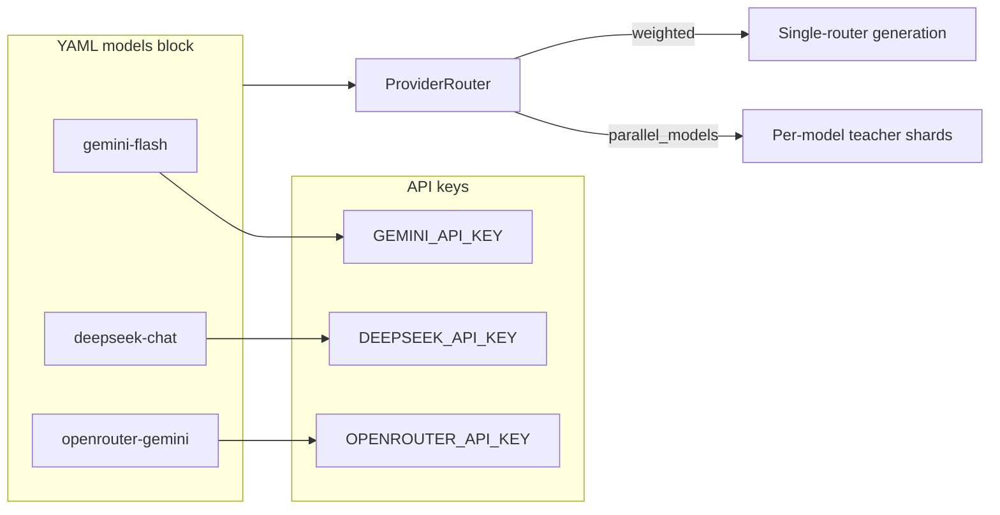

The writer refuses to overwrite an existing dataset unless `append: true` is
explicitly configured. This helps preserve expensive generations.

### SFT workflow: `stage: prompts`

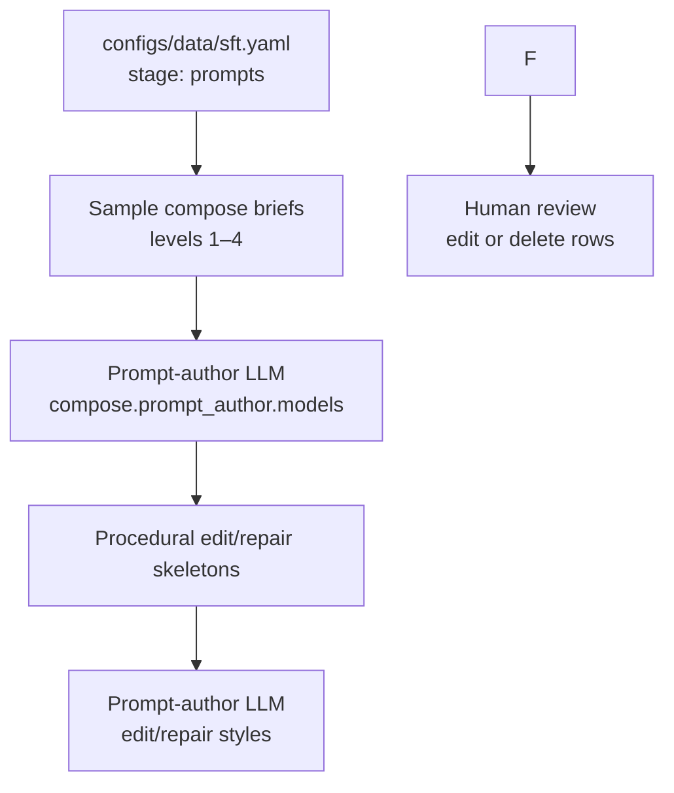

### SFT workflow: `stage: samples` → `validate` → `regenerate`

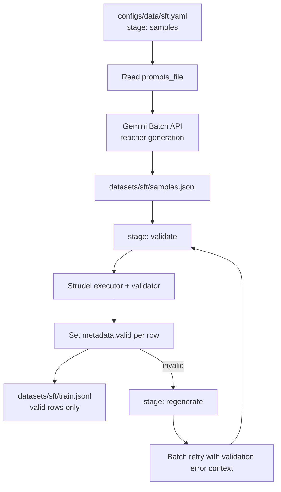

### SFT workflow: `stage: full`

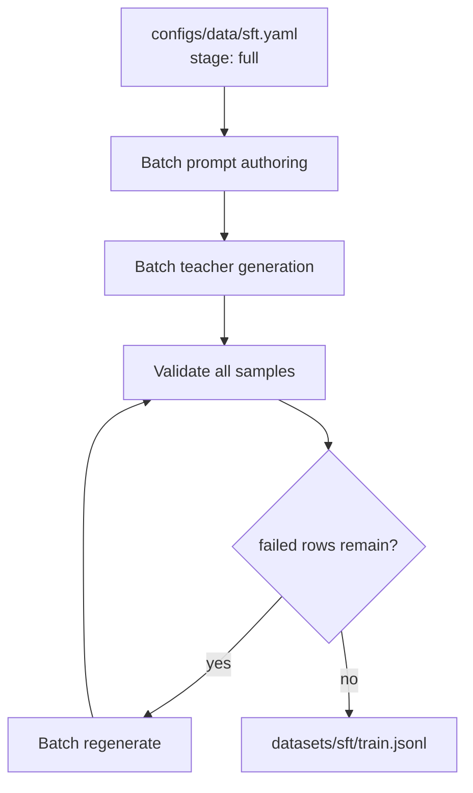

Provider keys and the full cross-pipeline diagram live in [workflows.md](workflows.md).

## RL task path

`configs/data/rl_tasks.yaml` generates 3,000 tasks by default. When
`prompt_author` is configured and `batch.enabled: true`, generation builds
procedural skeletons first, then batch-rewrites musician-facing prompts with a
random per-row style
(compose: scene/musician; edit: imperative/conversational; repair:
direct/collaborative/diagnostic). The prompt author sees scene hints only, not
constraint JSON. Verifier fields stay on the task; edit tasks keep `instruction`
for rewards.

RL `stage` mirrors SFT review flow:

| Stage | Output |
|---|---|
| `prompts` | Reviewable bank in `prompts_file` |
| `tasks` | Final `output` copied from curated `prompts_file` |
| `full` | Direct write to `output` |

Without `prompt_author`, legacy `mode: hybrid` still uses `llm_fraction` to
generate full task specs via LLM when keys are set. `datasets/rl/train.jsonl`
remains the committed smoke fixture. The benchmark config uses a separate seed
and is kept disjoint from the train set.

### RL workflow: `stage: prompts`

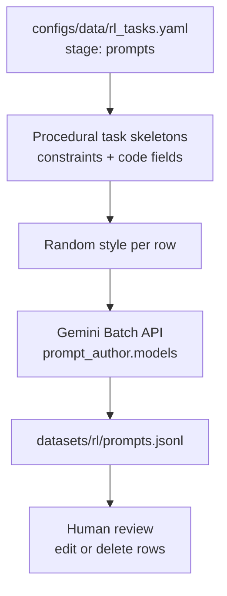

### RL workflow: `stage: tasks`

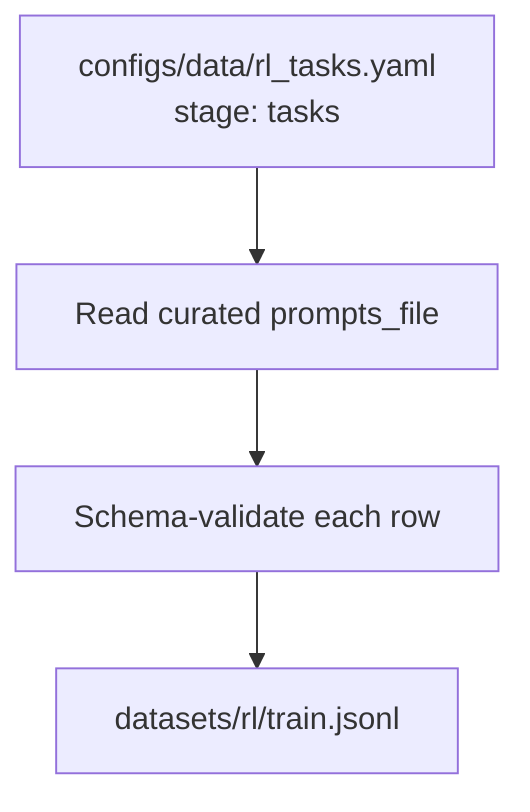

### RL workflow: `stage: full`

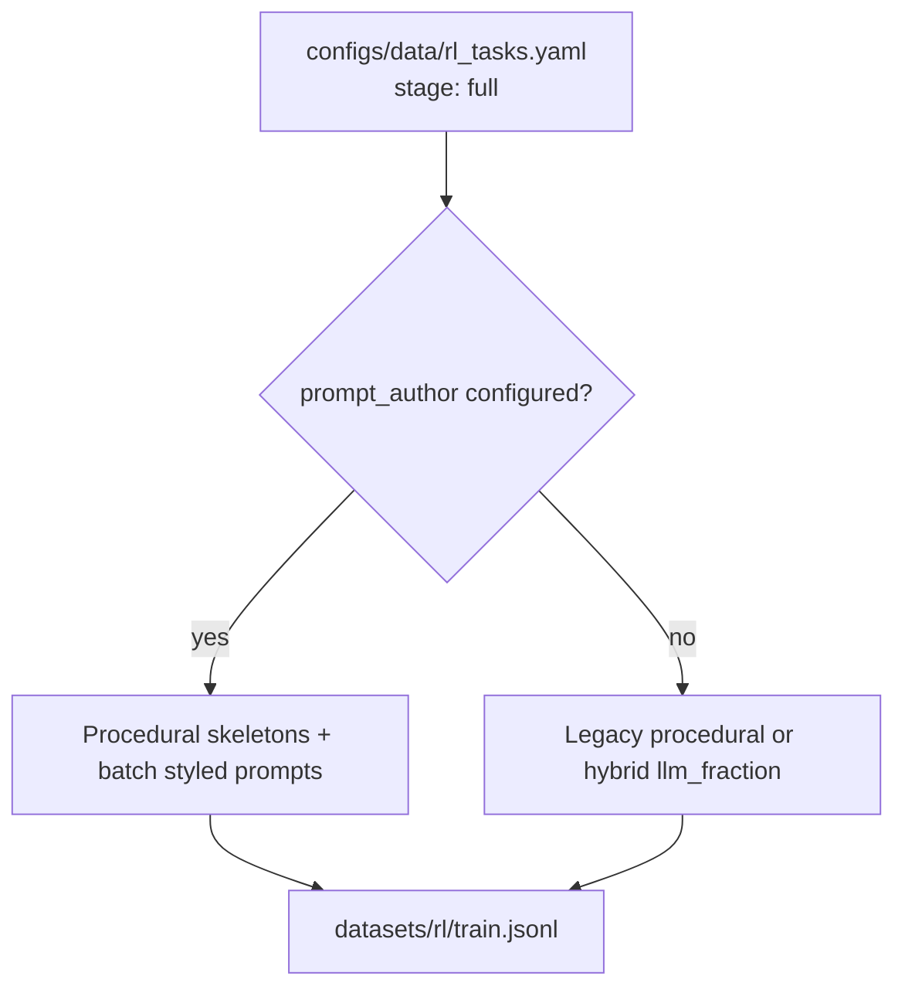

The procedural generator creates an exact requested count with a configurable
mix. The `prompt` field is always the final varied request shown to the model;
there is no separate generic prompt or hidden intent field. Composition tasks
sample verifier-friendly combinations. Repair tasks
mutate varied known-valid arrangements using the corruption handlers named in
`configs/data/vocab/repair_templates.yaml`. Every configured corruption must
have a matching handler. Editing tasks are drawn from verifier-supported tempo,
instrument, layer-count, and drum-density changes.

Musical vocabulary is data-driven under `configs/data/vocab/`: canonical
instrument concepts, aliases and their executable Strudel sound identifiers,
ensembles, moods, genres, rhythms, structures, textures, tempo ranges, compose
prompts, edit operations, and repair templates. Both procedural and LLM-backed
task generation consume these files. Prompts use musician-friendly instrument
names while model messages include the corresponding built-in, `gm_*`, or
percussion identifier expected by Strudel.cc.

Each task retains a 1–5 difficulty value for analysis and future sampling
policies. The current trainer shuffles the complete task bank.

## Rewards

Rewards are independent Python functions/classes:

| Component | Current meaning |
|---|---|
| Format | Completion validates against the exact response schema |
| Execution | Strudel produces a queryable pattern without an error |
| Constraints | Mean satisfaction across explicit tempo, instrument, and layer constraints |
| Edit consistency | Requested directional changes plus equality of named preserved features |
| Repair consistency | Equality of tempo, instruments, notes, layer count, and drum density to the valid reference |

`RewardEngine` provides a normalized weighted score for offline evaluation.
`RewardAdapter` exposes the same logic in TRL-compatible callables and shares an
LRU-like execution cache so the execution and constraint rewards do not execute
the same completion twice. Non-edit rows return `None` from the edit reward so
TRL can ignore that reward for those samples. Constraint applicability is decided
from the task, not the completion: tasks without supported explicit constraints
always return `None`, while invalid completions for constrained tasks receive zero.
Edit and repair consistency also receive zero when the candidate does not execute,
so structural similarity cannot reward an unchanged broken program.

The checked-in SFT smoke fixture passes execution, constraint, plan/code, and
edit/repair-consistency verification. SFT validation with `--check-execution`
repeats that full validation rather than checking execution alone.

Reward evolution should remain experimental and additive:

1. Establish format + execution.
2. Add explicit constraints.
3. Measure and add editing consistency.
4. Only then test rendered-audio or human preference rewards.

## Configuration and CLI

Training YAML lives under `configs/<model>/` (`gemma4_4b`, `qwen3_06b`). Each
model directory has a shared `model.yaml` extended by `sft.yaml`, `grpo.yaml`,
and smoke variants. Dataset generation configs stay under `configs/data/`.

`src/tunelm/cli.py` is the unified entry point behind `scripts/generate.py` and
`scripts/train.py`. Routing is inferred from the loaded config (SFT data when
`models` or `providers` is set; evaluation when `tasks` and `predictions` are
set; GRPO when `rewards` and training data are set; otherwise SFT).
`src/tunelm/training_preflight.py`
validates configs and dataset paths without loading model weights; use
`scripts/train.py --dry-run` on a laptop.

JarvisLabs launches a single config via `scripts/jarvislabs/cloud_train.py
--config ...`; there is no multi-stage pipeline config directory.

## Training

`SFTTrainer` consumes conversational prompt-completion rows and computes loss
only on the assistant completion. `GRPOTrainer` consumes conversational prompts
and custom reward functions. Both use a common causal-language-model loader and
PEFT LoRA adapter, save their
tokenizer/checkpoint, and write `experiment.json` with the full config, runtime,
dataset size, timestamp, and Git commit when available.

### SFT training workflow

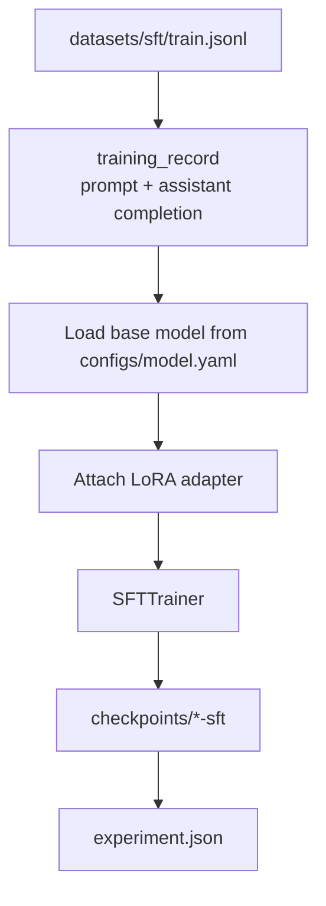

### GRPO training workflow

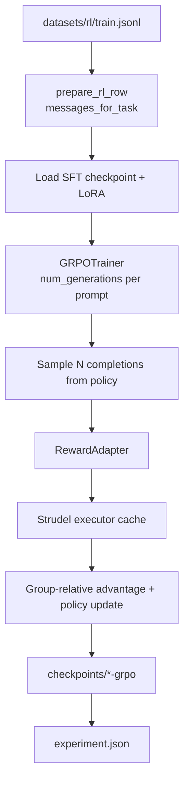

Gemma 4 E4B (`google/gemma-4-E4B-it`) is the default target. It has about 8B
total parameters and 4B effective parameters. Qwen3 0.6B is the
smaller baseline. TuneLM is text-only, so Gemma 4 deliberately loads its causal
language-model component rather than its unused vision/audio towers. Model
families can require different LoRA target-module names.

### End-to-end pipeline

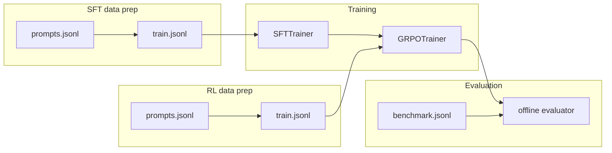

## Evaluation

Benchmark generation uses a separate seed and output path. The benchmark should
be generated once, versioned privately or checksummed, and never mixed into
training data. Evaluation joins `{task_id, completion}` prediction rows to tasks,
scores each independently, and writes both per-task JSONL and aggregate JSON.

Current aggregate metrics include reward component means and total reward by
task type. Plan consistency, diversity, and subjective preference remain future
metrics because the current implementation does not pretend those are solved by
string heuristics.

### Evaluation workflow

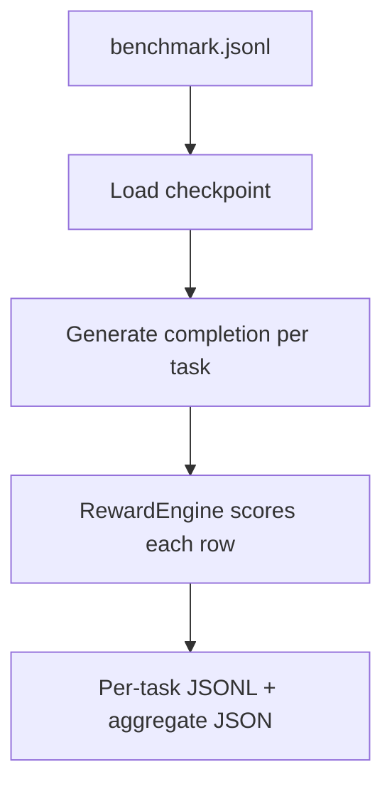

## Implementation status

| Plan area | Status |
|---|---|
| Shared schemas/repository structure | Implemented |
| Fast Strudel execution and feature analysis | Implemented |
| Provider abstraction | Implemented |
| Externalized vocab/templates under `configs/data/vocab/` | Implemented |
| Validated SFT generation | Implemented; requires API keys |
| SFT LoRA entry point | Implemented; GPU run pending |
| Procedural + hybrid RL task generation | Implemented |
| Format/execution/constraint/edit/repair rewards | Implemented |
| GRPO entry point | Implemented; GPU run pending |
| Fixed benchmark and offline evaluator | Implemented |
| Laptop-safe config verification (`train.py --dry-run`) | Implemented |
| Per-model config layout (`gemma4_4b`, `qwen3_06b`) | Implemented |
| Full audio rendering | Deferred |
| Audio/human music preference | Deferred |
| Adaptive weakness-driven tasks | Deferred |
| Production serving/quantization | Deferred |

## Design references

- [Strudel packages](https://strudel.cc/technical-manual/packages/)
- [Strudel REPL execution model](https://strudel.cc/technical-manual/repl/)
- [TRL SFTTrainer](https://huggingface.co/docs/trl/sft_trainer)
- [TRL GRPOTrainer](https://huggingface.co/docs/trl/grpo_trainer)
- [Gemini structured output](https://ai.google.dev/gemini-api/docs/structured-output)
- [OpenAI API quickstart](https://platform.openai.com/docs/quickstart)
