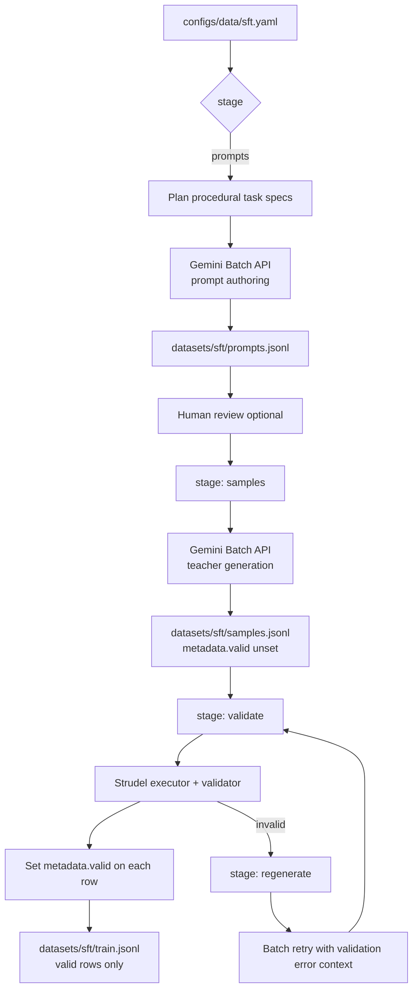
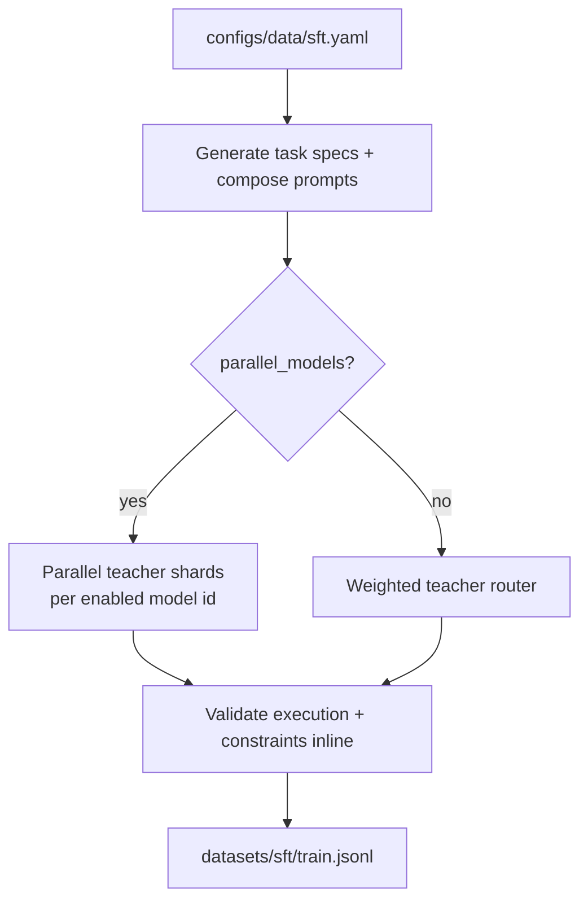
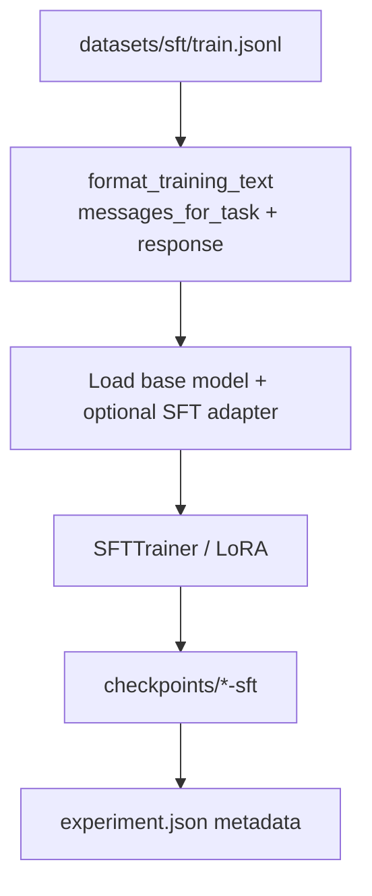
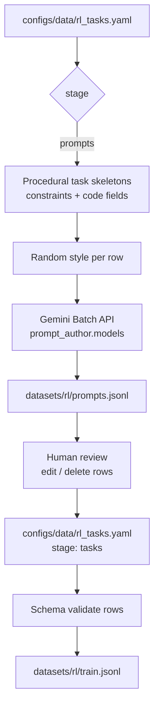
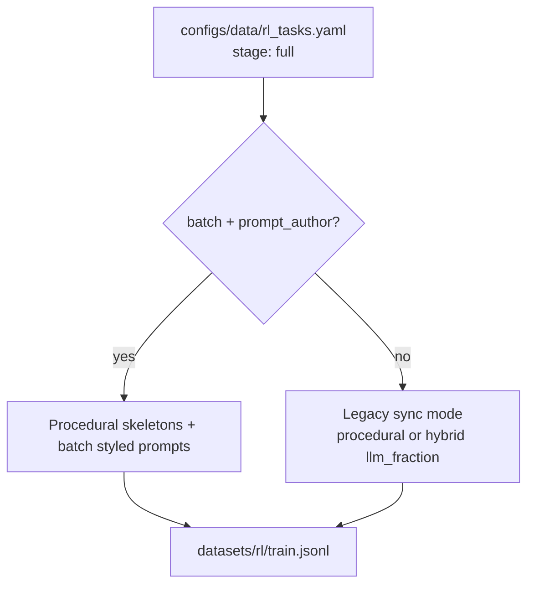
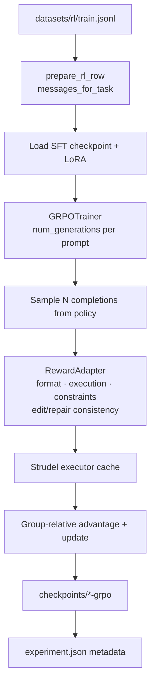
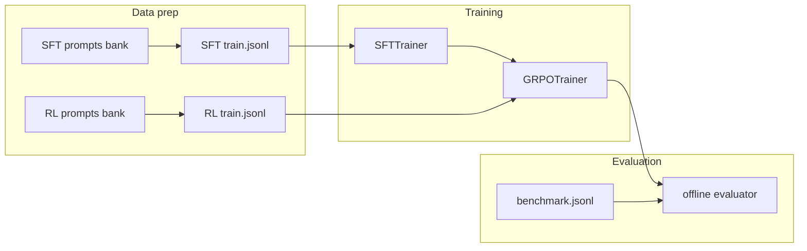

# TuneLM workflows

End-to-end diagrams for data preparation and training. Staged paths let you
review prompt banks before expensive teacher generation (SFT) or before locking
an RL task bank.

Committed smoke fixtures:

- SFT: `datasets/sft/sample.jsonl`
- RL: `datasets/rl/train.jsonl` (procedural/hybrid reference bank; regenerate for production)

## Model providers

Configured under `models` (preferred) or legacy `providers`. Each entry uses the
YAML key as the **model id** stored in dataset metadata:

```yaml
models:
  gemini-flash:
    enabled: true
    provider: gemini          # gemini | openai | anthropic | openrouter | deepseek
    model: gemini-2.5-flash   # API model slug (alias: model_name)
```

API keys (set in the shell, never committed):

| Provider | Environment variable |
|---|---|
| Gemini | `GEMINI_API_KEY` |
| OpenAI | `OPENAI_API_KEY` |
| Anthropic | `ANTHROPIC_API_KEY` |
| OpenRouter | `OPENROUTER_API_KEY` |
| DeepSeek | `DEEPSEEK_API_KEY` |

When `batch.enabled: true` (default in `configs/data/sft.yaml`), SFT generation
uses the Gemini Batch API at 50% of standard pricing. Set `batch.enabled: false`
to fall back to synchronous generation with optional `parallel_models`.

## SFT data preparation

### Batch workflow (`batch.enabled: true`)



| `stage` | Output | Notes |
|---|---|---|
| `prompts` | `prompts_file` | Batch prompt authoring only |
| `samples` | `samples_file` | Batch teacher responses; no Strudel check yet |
| `validate` | updates `samples_file` + `output` | Sets `metadata.valid` per row |
| `regenerate` | updates failed rows in `samples_file` | Re-validates when `batch.regenerate_validate: true` |
| `full` | all of the above | Runs prompts → samples → validate → regenerate loop |

`stage: responses` is an alias for `samples`.

### Legacy sync (`batch.enabled: false`)



## SFT training



## RL data preparation

### Staged (`stage: prompts` → review → `stage: tasks`)



### Full (`stage: full`)



## GRPO training



## Full pipeline (typical)


